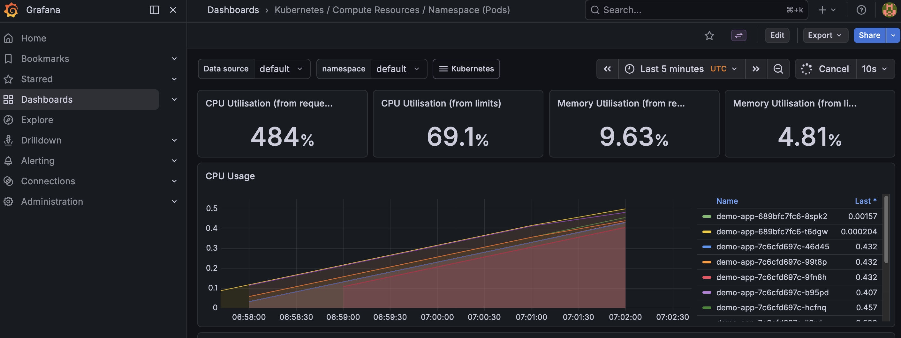
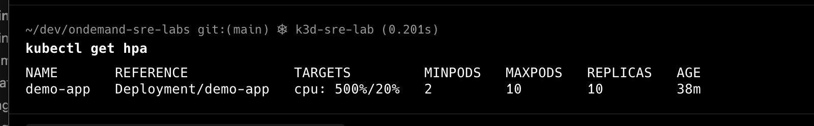

# OnDemand SRE Labs

# OnDemand SRE Labs

Hands-on Site Reliability Engineering labs built with Kubernetes, Prometheus, Grafana, and k6.

This repository demonstrates practical SRE concepts including observability, load testing, and horizontal pod autoscaling.

---
## Architecture

### Request Flow
````markdown
User Traffic
   ↓
k6 Load Generator
   ↓
Kubernetes Service
   ↓
Pods (demo-app)
   ↓
Metrics
   ↓
Prometheus → Grafana Dashboard
   ↓
HPA scales pods based on CPU
````
## Technology Stack

- Kubernetes
- Prometheus
- Grafana
- k6 Load Testing
- Horizontal Pod Autoscaler (HPA)

---

## Lab 1 — Kubernetes Deployment

Deploy a simple application to Kubernetes.

### Deploy

```bash
kubectl apply -f k8s/demo-app.yaml
```
### Verify
```bash
kubectl get pods
kubectl get svc
```
### Key Concepts:

- Kubernetes Deployment
- Service exposure
- Readiness probes

## Lab 2 — Observability (Prometheus + Grafana)

### Monitor the Kubernetes workload using Prometheus and Grafana.

### Metrics observed:

- CPU usage
- Memory usage
- Pod metrics
- Namespace utilization

Grafana dashboards provide real-time observability for the deployed application

## Lab 3 — Load Testing with k6

### Generate traffic against the Kubernetes service.

### Port forward
```bash
kubectl port-forward svc/demo-service 8080:80
```
### Run load test
```bash
k6 run load-testing/k6-load-test.js
```
This generates sustained traffic and allows observation of system behavior under load conditions.

## Lab 4 — Autoscaling under Load (HPA)

Kubernetes automatically scales the application when CPU usage exceeds the defined threshold.

### Create HPA
```bash
kubectl autoscale deployment demo-app --cpu=20% --min=2 --max=10
```
### Observe scaling
```bash
kubectl get hpa
kubectl get pods -l app=demo -w
```
### Example output:
```bash
NAME       REFERENCE             TARGETS         MINPODS   MAXPODS   REPLICAS
demo-app   Deployment/demo-app   cpu: 500%/20%   2         10        10
```
This shows that Kubernetes automatically increased replicas to handle the load.
## Evidence
### Grafana Metrics

### HPA Output


## Repository Structure

```text
ondemand-sre-labs
│
├─ assets
│   ├─ autoscaling-grafana.png
│   └─ hpa-output.png
│
├─ k8s
│   └─ demo-app.yaml
│
├─ load-testing
│   └─ k6-load-test.js
│
└─ README.md
```
## What This Demonstrates

This repository demonstrates practical SRE concepts:

- Kubernetes application deployment
- Observability using Prometheus and Grafana
- Synthetic load generation with k6
- Horizontal Pod Autoscaling (HPA)
- System behavior under stress conditions

## Author

**Emrah Gokce Bayram**

Site Reliability Engineer / Cloud Infrastructure

## License

MIT
