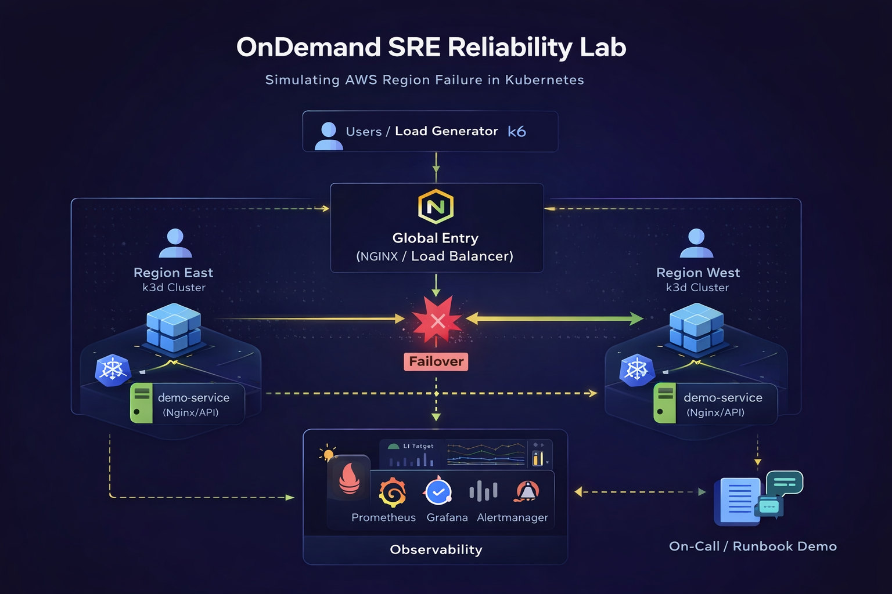

# OnDemand SRE Reliability Lab

Production-style reliability engineering lab used to simulate failure scenarios, validate observability pipelines, and demonstrate incident response patterns.

This lab environment helps reproduce real-world reliability challenges such as:

- Kubernetes service failures
- traffic spikes and load testing
- monitoring and alerting pipelines
- incident response workflows

---

## Architecture

The lab simulates a production-style system with:

- Kubernetes (k3d clusters)
- NGINX demo service
- Prometheus monitoring (planned)
- Grafana dashboards (planned)
- Alertmanager alerts (planned)
- k6 load testing (planned)
- chaos failure simulation (planned)



---

## Quickstart

### Prerequisites
- kubectl
- k3d

Create a local cluster:

```bash
k3d cluster create sre-lab
kubectl get nodes
```
Deploy the demo app:
```bash
kubectl apply -f k8s/demo-app.yaml
kubectl get pods
kubectl get svc demo-service
```
Test locally (NodePort is fixed to 30007):
```bash
curl -i http://localhost:30007
```

Lab Scenarios

🧪 Lab 1 — Kubernetes Self Healing

This lab demonstrates Kubernetes self-healing behavior.

1. Deploy the demo service:
```bash
kubectl apply -f k8s/demo-app.yaml
```
2. Verify pods:
```bash
kubectl get pods
```
3. Simulate a failure (delete a pod):
```bash
kubectl delete pod -l app=demo --field-selector=status.phase=Running
```
Or delete a specific pod:
```bash
kubectl get pods
kubectl delete pod <pod-name>
```
4. Watch the Deployment recreate the pod:
```bash
kubectl get pods -w
```
Expected outcome:

* One pod is terminated
* A new pod is created automatically to maintain replicas: 3
* Service continues to respond (readinessProbe helps ensure traffic goes only to ready pods)

Repository Structure

ondemand-sre-labs
│
├── diagrams
│   └── reliability-lab-architecture.png
│
├── k8s
│   └── demo-app.yaml
│
├── monitoring
│
├── load-testing
│
├── chaos
│
├── README.md
└── .gitignore

Purpose

This repository supports the OnDemand SRE consulting platform by providing reproducible reliability engineering labs and demos.

Website

https://ondemandsre.com

License

MIT
